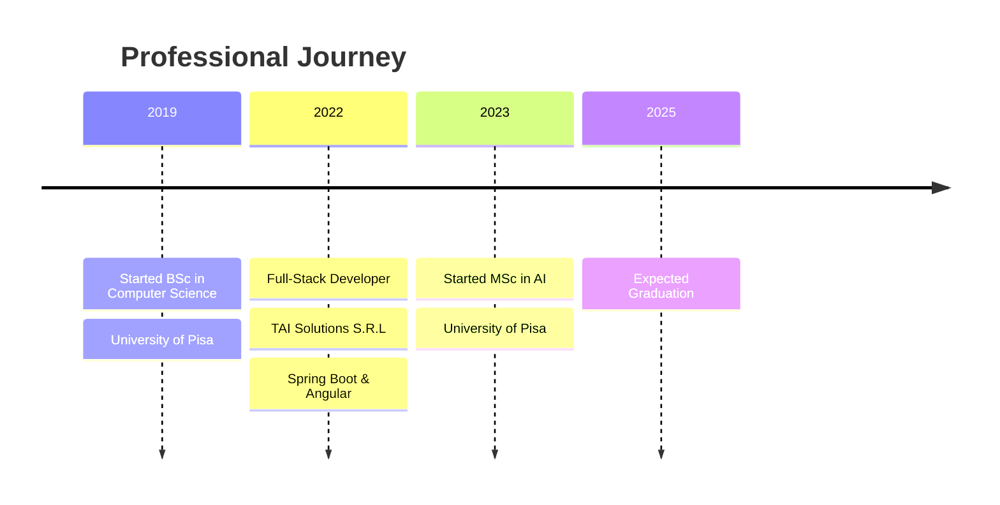

  

  

## 🤖 About Me

  <table>
    <tr>
      <td colspan="2" align="center">
        
        <h3>⚡ OLEKSIY NEDOBOIYCHUK ⚡</h3>
        <em>"Not all who wander through code are lost"</em>
      </td>
    </tr>
    <tr>
      <td><b>CLASS:</b></td>
      <td>Full-Stack Developer with AI specialization</td>
    </tr>
    <tr>
      <td><b>ORIGIN:</b></td>
      <td>Pisa, Italy 🇮🇹</td>
    </tr>
    <tr>
      <td><b>TRAINING:</b></td>
      <td>
        MSc Computer Science (AI) - University of Pisa 
        BSc Computer Science - University of Pisa
      </td>
    </tr>
    <tr>
      <td><b>SPECIAL ABILITIES:</b></td>
      <td>
        🧠 AI Whisperer 
        🤖 Algorithm Tamer 
        🎮 Digital Reinforcer 
        🏗️ Stack Constructor 
        🧩 Puzzle Master
      </td>
    </tr>
    <tr>
      <td><b>COMMUNICATION:</b></td>
      <td>English 🇬🇧, Italian 🇮🇹, Ukrainian 🇺🇦, Russian 🇷🇺</td>
    </tr>
    <tr>
      <td><b>SECRET POWER:</b></td>
      <td>Can debug code with just a glance 👀✨</td>
    </tr>
    <tr>
      <td><b>WEAKNESS:</b></td>
      <td>Coffee supply interruptions ☕</td>
    </tr>
    <tr>
      <td><b>QUEST:</b></td>
      <td>A dedicated and passionate programmer, eager to contribute and grow</td>
    </tr>
  </table>

## 🚀 Skills

  
| Category | Skills |
|----------|--------|
| **Languages** |     |
| **Frontend** |     |
| **Frameworks** |     |
| **ML/AI** |    |
| **Data** |     |
| **Databases** |    |
| **Tools** |    |

## 🔥 Projects

🧠 <b>Neural Network From Scratch</b>

 
Designed a flexible Neural Network using only Python and NumPy, implementing forward and backward propagation with Nesterov momentum optimization. Added L1/L2 regularization and grid search for hyperparameter tuning.
 
<i>Technologies: Python, NumPy</i>

🤖 <b>ProbLog Based AI Agent</b>

 
Developed an AI agent using ProbLog for a 2D fighting game that adapts to opponents through dynamic probability estimation. Outperformed MCTS, MinMax, and Prolog-based agents in simulations.
 
<i>Technologies: ProbLog, Probabilistic Programming</i>

📱 <b>Telegram Bot with GitHub Integration</b>

 
Created a Telegram bot that integrates with GitHub webhooks to provide repository event notifications and respond to user commands.
 
<i>Technologies: Python, python-telegram-bot, GitHub API</i>

🌐 <b>Personal Web Application</b>

 
Developed a personal website using Svelte and Django with PostgreSQL database integration. Deployed on AWS using Nginx and Apache.
 
<i>Technologies: Svelte, Django, PostgreSQL, AWS, Nginx, Apache</i>

📊 <b>Professional Cycling Analysis</b>

 
Applied data mining techniques including cleaning, imputation, transformation, anomaly detection, and clustering to analyze cycling data and predict rider performance.
 
<i>Technologies: Python, Data Mining, Machine Learning</i>

🖥️ <b>File Management System</b>

 
Designed a concurrent file management protocol in C with socket programming to handle multiple clients, supporting file operations with error handling and cache management.
 
<i>Technologies: C, Socket Programming, Multi-threading</i>

## 💼 Experience

## 📈 GitHub Stats

  
  

## 📫 Connect with Me

  
  
  
  

  

