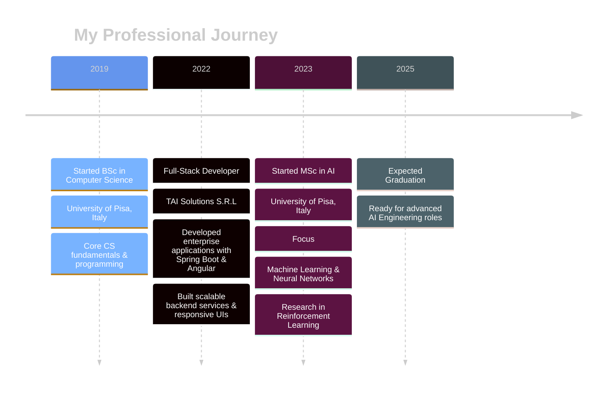

   
   

  
  

   
  
 
  
  

    
    
    
    
  

  
   
  

## About Me

*Forged in the digital fires of Pisa, trained in the arcane arts of AI.*

| Stat             | Details                                                                                                                                                                                                                                                           |
| :--------------- | :---------------------------------------------------------------------------------------------------------------------------------------------------------------------------------------------------------------------------------------------------------------- |
| **Class:**      | Junior Software Engineer                                                                                                                                                                                                           |
| **Origin:**     | Pisa, Italy                                                                                                                                                                                                                                                       |
| **Training:**   | MSc Computer Science (AI Focus) - *University of Pisa*   BSc Computer Science - *University of Pisa*                                                                                                                                                           |
| **Abilities:**  |        |
| **Languages:** |                                  |
| **Secret Power:** | *Patience*                                                                                                                                                                                                                |
| **Weakness:**   | Critical dependency on caffeine infusions                                                                                                                                                                                                                         |
| **Quest:**      | To weave elegant code, conquer complex challenges, and continuously evolve. Seeking epic collaborations!                                                                                                                                                            |

## Tech Arsenal

<table align="left">
  <tr>
    <td align="left">
      <h3>🔠 Languages</h3>
      

        
        
        
        
      

    </td>
    <td align="left">
      <h3>🌐 Frontend</h3>
      

        
        
        
        
      

    </td>
  </tr>
  <tr>
    <td align="left">
      <h3>🧩 Frameworks</h3>
      

        
        
        
        
      

    </td>
    <td align="left">
      <h3>🧠 ML/AI</h3>
      

        
        
        
      

    </td>
  </tr>
  <tr>
    <td align="left">
      <h3>📊 Data Science</h3>
      

        
        
        
        
      

    </td>
    <td align="left">
      <h3>🗄️ Databases</h3>
      

        
        
        
      

    </td>
  </tr>
  <tr>
    <td align="left" colspan="2">
      <h3>🛠️ DevOps & Tools</h3>
      

        
        
        
        
        
      

    </td>
  </tr>
</table>

  

    
<b>📈 Skill Proficiency Chart</b>

     
    
  

   

## Projects

  
   

<b>Neural Network From Scratch</b>

 
Designed a flexible Neural Network using only Python and NumPy, implementing forward and backward propagation with Nesterov momentum optimization. Added L1/L2 regularization and grid search for hyperparameter tuning.
 
<i>Technologies: Python, NumPy</i>

<b>ProbLog Based AI Agent</b>

 

Developed an AI agent using ProbLog for a 2D fighting game that adapts to opponents through dynamic probability estimation. Outperformed MCTS, MinMax, and Prolog-based agents in simulations.
 
<i>Technologies: ProbLog, Probabilistic Programming</i>

<b>Telegram Bot with GitHub Integration</b>

 
Created a Telegram bot that integrates with GitHub webhooks to provide repository event notifications and respond to user commands.
 
<i>Technologies: Python, python-telegram-bot, GitHub API</i>

<b>Personal Web Application</b>

 

Developed a personal website using Svelte and Django with PostgreSQL database integration. Deployed on AWS using Nginx and Apache.
 
<i>Technologies: Svelte, Django, PostgreSQL, AWS, Nginx, Apache</i>

<b>Professional Cycling Analysis</b>

 
Applied data mining techniques including cleaning, imputation, transformation, anomaly detection, and clustering to analyze cycling data and predict rider performance.
 
<i>Technologies: Python, Data Mining, Machine Learning</i>

<b>File Management System</b>

 
Designed a concurrent file management protocol in C with socket programming to handle multiple clients, supporting file operations with error handling and cache management.
 
<i>Technologies: C, Socket Programming, Multi-threading</i>

## Professional Journey

  
   

## Performance Analytics

 
  

  
  
  
  
  

    
  

   
  
  
  

## Current Focus

  
  <table>
    <tr>
      <td align="center" width="96">
        
         Advanced ML
      </td>
      <td align="center" width="96">
        
         Modern JS
      </td>
      <td align="center" width="96">
        
         DevOps
      </td>
      <td align="center" width="96">
        
         Orchestration
      </td>
      <td align="center" width="96">
        
         Cloud Native
      </td>
    </tr>
  </table>

## Connect with Me

  
  <h4>Let's build something amazing together!</h4>
  
  
  
  
  

 

  
  
  
<small>"The function of good software is to make the complex appear to be simple." — Grady Booch</small>

  

