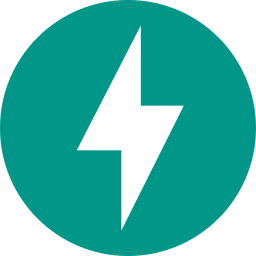
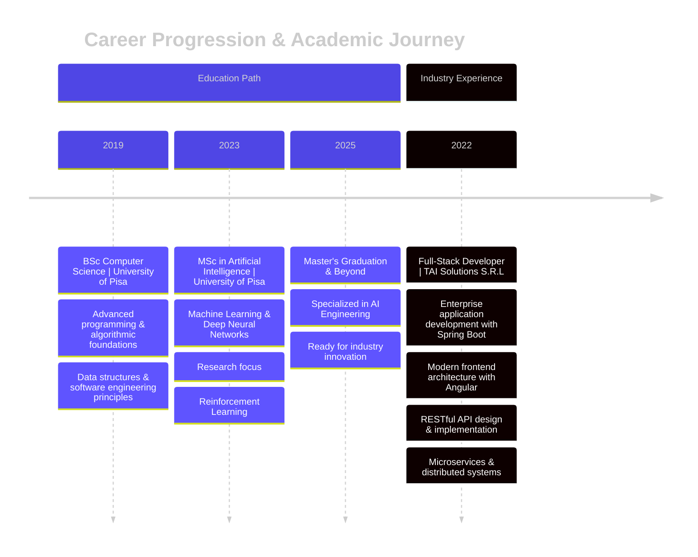

## About Me
My name is **Oleksiy Nedobichuk**, I'm graduating in 2025 with a Master's degree in Computer Science, specializing in Artificial Intelligence. I'm a Software Developer devotee, with a passion for Reinforcement Learning field. I have a solid foundation in full-stack development, and I'm always thirsting for knowledge and I'm yearning to learn new technologies. My life goals are to contribute to innovative software solutions, and to be part of a team that pushes the boundaries of technology. I am currently seeking opportunities to apply my skills and grow in a dynamic environment.

     
    &nbsp;&nbsp;&nbsp;&nbsp;&nbsp;&nbsp;
    &nbsp;&nbsp;&nbsp;&nbsp;&nbsp;&nbsp;
    &nbsp;&nbsp;&nbsp;&nbsp;&nbsp;&nbsp;
    

  
  
  > *Forged in the digital fires of Pisa, trained in the arcane arts of AI.*

| | |
|:-------------:|:-------------|
| **CLASS:** | Junior Software Developer with AI specialization |
| **ORIGIN:** | Pisa, Italy |
| **TRAINING:** | MSc Computer Science (AI) - University of Pisa BSc Computer Science - University of Pisa |
| **SPECIAL ABILITIES:** |✧ AI Whisperer ✧ Algorithm Tamer ✧ Digital Reinforcer ✧ Stack Constructor ✧ Puzzle Master |
| **COMMUNICATION:** | English, Italian, Ukrainian, Russian |
| **SECRET POWER:** | Can debug code with just a glance |
| **WEAKNESS:** | Coffee supply interruptions |
| **QUEST:** | A dedicated and passionate programmer, eager to contribute and grow |

## Tech Arsenal

<table align="left">
  <tr>
    <td align="left">
      <h2> Languages</h2>
      

        &nbsp;&nbsp;
        &nbsp;&nbsp;
        &nbsp;&nbsp;
        &nbsp;&nbsp;
        &nbsp;&nbsp;
        
      

    </td>
    <td align="left">
      <h3> Frontend</h3>
      

        &nbsp;&nbsp;
        &nbsp;&nbsp;
        &nbsp;&nbsp;
        &nbsp;&nbsp;
        &nbsp;&nbsp;
      

    </td>
  </tr>
  <tr>
    <td align="left">
      <h3> Backend</h3>
      

        &nbsp;&nbsp;
        &nbsp;&nbsp;
        &nbsp;&nbsp;
      

    </td>
    <td align="left">
      <h3> ML/AI</h3>
      

        &nbsp;&nbsp;
        &nbsp;&nbsp;
        &nbsp;&nbsp;
        &nbsp;&nbsp;
      

    </td>
  </tr>
  <tr>
    <td align="left">
      <h3> Data Science</h3>
      

        &nbsp;&nbsp;
        &nbsp;&nbsp;
        &nbsp;&nbsp;
        &nbsp;&nbsp;
        &nbsp;&nbsp;
      

    </td>
    <td align="left">
      <h3> Databases</h3>
      

        &nbsp;&nbsp;
        &nbsp;&nbsp
      

    </td>
  </tr>
  <tr>
    <td align="left" colspan="2">
      <h3>🛠️ DevOps & Tools</h3>
      

        &nbsp;&nbsp;
        &nbsp;&nbsp;
        &nbsp;&nbsp;
        &nbsp;&nbsp;
      

    </td>
  </tr>
</table>

  

## Professional Journey

# Projects

<table>
  <tr>
    <td align="left" colspan="2">
      
      <h2>DIGITAL CREATIONS</h2>
    </td>
  </tr>
  <tr>
    <td align="left">
      <h3> FROM SCRATCH</h3>
      

      
Designed a flexible Neural Network using only Python and NumPy, implementing forward and backward propagation with Nesterov momentum optimization. Added L1/L2 regularization and grid search for hyperparameter tuning.

      

        
        
      

    </td>
    <td align="left">
      <h3> AI AGENT</h3>
      

      
Developed an AI agent using ProbLog for a 2D fighting game that adapts to opponents through dynamic probability estimation. Outperformed MCTS, MinMax, and Prolog-based agents in simulations.

      

        
        
      

    </td>
  </tr>
  <tr>
    <td align="left" colspan="2">
      
    </td>
  </tr>
  <tr>
    <td align="left">
      <h3> WITH GITHUB INTEGRATION</h3>
      

      
Created a Telegram bot that integrates with GitHub webhooks to provide repository event notifications and respond to user commands.

      

        
        
        
      

    </td>
    <td align="left">
      <h3> APPLICATION</h3>
      

      
Developed a personal website using Svelte and Django with PostgreSQL database integration. Deployed on AWS using Nginx and Apache.

      

        
        
        
        
      

    </td>
  </tr>
  <tr>
    <td align="left" colspan="2">
      
    </td>
  </tr>
  <tr>
    <td align="left">
      <h3> ANALYSIS</h3>
      

      
Applied data mining techniques including cleaning, imputation, transformation, anomaly detection, and clustering to analyze cycling data and predict rider performance.

      

        
        
        
      

    </td>
    <td align="left">
      <h3> SYSTEM</h3>
      

      
Designed a concurrent file management protocol in C with socket programming to handle multiple clients, supporting file operations with error handling and cache management.

      

        
        
        
      

    </td>
  </tr>
</table>

## Current Focus

  <h3>🚀 Current technological quests and skill enhancement paths</h3>
  
  

  <table>
    <tr>
      <td align="left">
         
        <b>Advanced Deep Learning</b>
      </td>
      <td align="left">
         
        <b>Modern C++</b>
      </td>
      <td align="left">
         
        <b>DevOps</b>
      </td>
    </tr>
    <tr>
      <td align="left">
         
        <b>Orchestration</b>
      </td>
      <td align="left">
         
        <b>Cloud Native</b>
      </td>
      <td align="left">
        <h2>RL</h2>
        <b>Reinforcement Learning</b>
      </td>
    </tr>
  </table>
  
  <em>Focusing on mastering intelligent systems through reinforcement learning while expanding my full-stack and cloud infrastructure expertise.</em>

## Performance Analytics

 
  

  
  
  
  

  
  
  
  
  

  

## Latest Blog Posts
<!-- BLOG-POST-LIST:START -->
- [Svelte + Tailwind With Rollup And Django//Flask As The Backend](https://nedo.im/blog/2025/04/14/svelte-tailwind-with-rollup-and-djangoflask-as-the-backend)
- [A Problog-Based Stochastic Agent For One-On-One Fighting Game](https://nedo.im/blog/2025/03/06/a-problog-based-stochastic-agent-for-one-on-one-fighting-game)
- [From Zero To 500+ Linkedin Connections](https://nedo.im/blog/2025/02/12/from-zero-to-500-linkedin-connections)
<!-- BLOG-POST-LIST:END -->

## Let's Connect & Collaborate

  
  
  

   
  
  
  

    
  

  
  
"The function of good software is to make the complex appear to be simple." — Grady Booch

  
  

