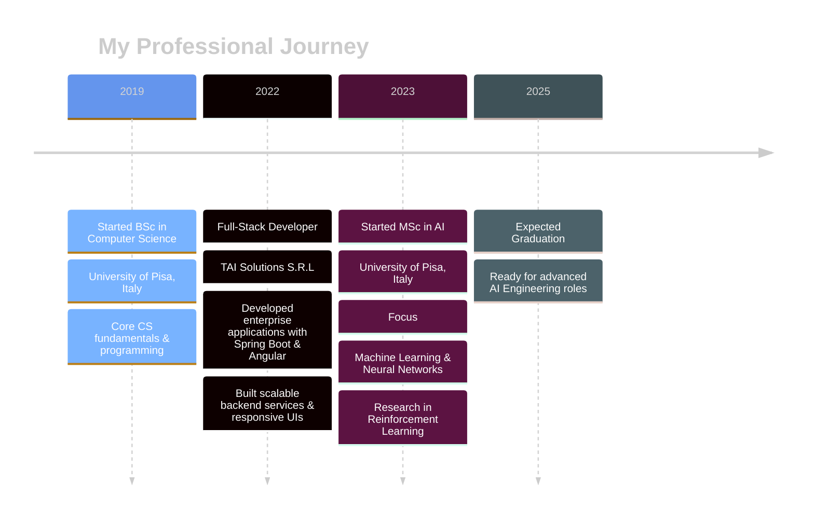

   
   

  
  

   
  
 
  
  

    
    
    
    
  

  
   
  

## About Me

  
  
  > *Forged in the digital fires of Pisa, trained in the arcane arts of AI.*

<table align="center">
  <tr>
    <td align="center" width="50%">
      
    </td>
    <td align="center" width="50%">
      
    </td>
  </tr>
  <tr>
    <td align="center" colspan="2">
      
      
    </td>
  </tr>
  <tr>
    <td align="center" colspan="2">
      <h3>Abilities</h3>
      

        
        
        
        
        
      

    </td>
  </tr>
  <tr>
    <td align="center" colspan="2">
      <h3>Languages</h3>
      

        
        
        
      

    </td>
  </tr>
  <tr>
    <td align="center">
      <h3>Secret Power</h3>
      
    </td>
    <td align="center">
      <h3>☕ Weakness</h3>
      
    </td>
  </tr>
  <tr>
    <td align="center" colspan="2">
      <h3>Quest</h3>
      
      
    </td>
  </tr>
</table>

<pre align="center">
     ___           ___           ___           ___     
    /\  \         /\__\         /\  \         /\  \    
   /::\  \       /:/ _/_       /::\  \       /::\  \   
  /:/\:\  \     /:/ /\__\     /:/\:\  \     /:/\:\  \  
 /:/  \:\  \   /:/ /:/ _/_   /:/ /::\  \   /:/ /::\  \ 
/:/__/ \:\__\ /:/_/:/ /\__\ /:/_/:/\:\__\ /:/_/:/\:\__\
\:\  \ /:/  / \:\/:/ /:/  / \:\/:/  \/__/ \:\/:/  \/__/
 \:\  /:/  /   \::/_/:/  /   \::/__/       \::/__/     
  \:\/:/  /     \:\/:/  /     \:\  \        \:\  \     
   \::/  /       \::/  /       \:\__\        \:\__\    
    \/__/         \/__/         \/__/         \/__/    
</pre>

## Tech Arsenal

<table align="center">
  <tr>
    <td align="center">
      <h3>🔠 Languages</h3>
      

        
        
        
        
      

    </td>
    <td align="center">
      <h3>🌐 Frontend</h3>
      

        
        
        
        
      

    </td>
  </tr>
  <tr>
    <td align="center">
      <h3>🧩 Frameworks</h3>
      

        
        
        
        
      

    </td>
    <td align="center">
      <h3>🧠 ML/AI</h3>
      

        
        
        
      

    </td>
  </tr>
  <tr>
    <td align="center">
      <h3>📊 Data Science</h3>
      

        
        
        
        
      

    </td>
    <td align="center">
      <h3>🗄️ Databases</h3>
      

        
        
        
      

    </td>
  </tr>
  <tr>
    <td align="center" colspan="2">
      <h3>🛠️ DevOps & Tools</h3>
      

        
        
        
        
        
      

    </td>
  </tr>
</table>

  

    
<b>📈 Skill Proficiency Chart</b>

     
    
  

## Professional Journey

  
   

## Projects

  
  <h2>DIGITAL CREATIONS</h2>

<!-- Neural Network Project -->

  

     FROM SCRATCH
  

  

  
Designed a flexible Neural Network using only Python and NumPy, implementing forward and backward propagation with Nesterov momentum optimization. Added L1/L2 regularization and grid search for hyperparameter tuning.

  

    
    
  

<!-- ProbLog AI Agent Project -->

  

     AI AGENT
  

  

  
Developed an AI agent using ProbLog for a 2D fighting game that adapts to opponents through dynamic probability estimation. Outperformed MCTS, MinMax, and Prolog-based agents in simulations.

  

    
    
  

  

<!-- Telegram Bot Project -->

  

     WITH GITHUB INTEGRATION
  

  

  
Created a Telegram bot that integrates with GitHub webhooks to provide repository event notifications and respond to user commands.

  

    
    
    
  

<!-- Personal Web Application Project -->

  

     APPLICATION
  

  

  
Developed a personal website using Svelte and Django with PostgreSQL database integration. Deployed on AWS using Nginx and Apache.

  

    
    
    
    
  

  

<!-- Professional Cycling Analysis Project -->

  

     ANALYSIS
  

  

  
Applied data mining techniques including cleaning, imputation, transformation, anomaly detection, and clustering to analyze cycling data and predict rider performance.

  

    
    
    
  

<!-- File Management System Project -->

  

     SYSTEM
  

  

  
Designed a concurrent file management protocol in C with socket programming to handle multiple clients, supporting file operations with error handling and cache management.

  

    
    
    
  

## Current Focus

  <h3>🚀 Current technological quests and skill enhancement paths</h3>
  
  

  <h3>🔥 SKILL DEVELOPMENT PATHWAYS 🔥</h3>

  <table>
    <tr>
      <td align="center">
         
        <b>Advanced Deep Learning</b>
      </td>
      <td align="center">
         
        <b>Modern C++</b>
      </td>
      <td align="center">
         
        <b>DevOps</b>
      </td>
    </tr>
    <tr>
      <td align="center">
         
        <b>Orchestration</b>
      </td>
      <td align="center">
         
        <b>Cloud Native</b>
      </td>
      <td align="center">
        <h2>RL</h2>
        <b>Reinforcement Learning</b>
      </td>
    </tr>
  </table>
  
  <em>Focusing on mastering intelligent systems through reinforcement learning while expanding my full-stack and cloud infrastructure expertise.</em>

## Performance Analytics

 
  

  
  
  
  

  
  
  
  

  

## Latest Blog Posts
<!-- BLOG-POST-LIST:START -->
- [Svelte + Tailwind With Rollup And Django//Flask As The Backend](https://nedo.im/blog/2025/04/14/svelte-tailwind-with-rollup-and-djangoflask-as-the-backend)
- [A Problog-Based Stochastic Agent For One-On-One Fighting Game](https://nedo.im/blog/2025/03/06/a-problog-based-stochastic-agent-for-one-on-one-fighting-game)
- [From Zero To 500+ Linkedin Connections](https://nedo.im/blog/2025/02/12/from-zero-to-500-linkedin-connections)
<!-- BLOG-POST-LIST:END -->

## Let's Connect & Collaborate

  
  
  

   
  
  
  

    
  

  
  
"The function of good software is to make the complex appear to be simple." — Grady Booch

  
  

