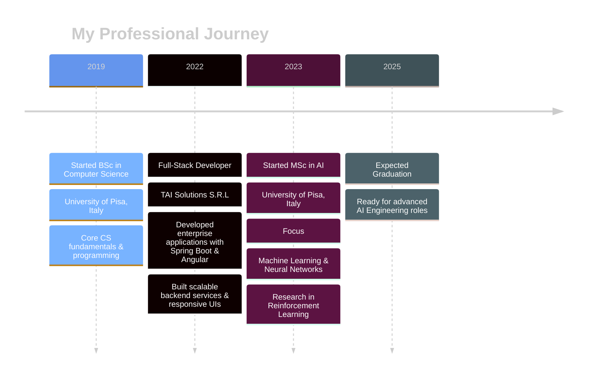

   
   

  
  

   
  
 
  
  

    
    
    
    
  

  
   
  

## About Me

    Forged in the digital fires of Pisa, trained in the arcane arts of AI.

    

    /profile data/

<table style="width: 90%; border-collapse: separate; border-spacing: 0; margin: 20px auto; border: none;">
    <tr style="background: transparent;">
        <th style="font-family: 'Courier New', monospace; color: #2F3542; text-align: left; padding: 12px; border-bottom: 1px solid #ddd;">Attribute</th>
        <th style="font-family: 'Courier New', monospace; color: #2F3542; text-align: left; padding: 12px; border-bottom: 1px solid #ddd;">Value</th>
    </tr>
    <tr style="background: rgba(255, 255, 255, 0.6);">
        <td style="color: #2F3542; font-weight: bold; padding: 10px; border-bottom: 1px solid #eee;">Class</td>
        <td style="color: #2F3542; padding: 10px; border-bottom: 1px solid #eee; font-family: 'Courier New', monospace;">Junior Software Engineer</td>
    </tr>
    <tr style="background: rgba(245, 247, 250, 0.6);">
        <td style="color: #2F3542; font-weight: bold; padding: 10px; border-bottom: 1px solid #eee;">Origin</td>
        <td style="color: #2F3542; padding: 10px; border-bottom: 1px solid #eee; font-family: 'Courier New', monospace;">Pisa, Italy</td>
    </tr>
    <tr style="background: rgba(255, 255, 255, 0.6);">
        <td style="color: #2F3542; font-weight: bold; padding: 10px; border-bottom: 1px solid #eee;">Training</td>
        <td style="color: #2F3542; padding: 10px; border-bottom: 1px solid #eee; font-family: 'Courier New', monospace;">MSc Computer Science (AI Focus) - <i>University of Pisa</i> BSc Computer Science - <i>University of Pisa</i></td>
    </tr>
    <tr style="background: rgba(245, 247, 250, 0.6);">
        <td style="color: #2F3542; font-weight: bold; padding: 10px; border-bottom: 1px solid #eee;">Abilities</td>
        <td style="color: #2F3542; padding: 10px; border-bottom: 1px solid #eee;">
            
AI Whisperer

            
Algorithm Tamer

            
Digital Reinforcer

            
Stack Constructor

            
Puzzle Master

        </td>
    </tr>
    <tr style="background: rgba(255, 255, 255, 0.6);">
        <td style="color: #2F3542; font-weight: bold; padding: 10px; border-bottom: 1px solid #eee;">Languages</td>
        <td style="color: #2F3542; padding: 10px; border-bottom: 1px solid #eee;">
            
English: Fluent

            
Italian: Proficient

            
Ukrainian: Native

        </td>
    </tr>
    <tr style="background: rgba(245, 247, 250, 0.6);">
        <td style="color: #2F3542; font-weight: bold; padding: 10px; border-bottom: 1px solid #eee;">Secret Power</td>
        <td style="color: #2F3542; padding: 10px; border-bottom: 1px solid #eee; font-style: italic; font-family: 'Georgia', serif;">Patience</td>
    </tr>
    <tr style="background: rgba(255, 255, 255, 0.6);">
        <td style="color: #2F3542; font-weight: bold; padding: 10px; border-bottom: 1px solid #eee;">Weakness</td>
        <td style="color: #2F3542; padding: 10px; border-bottom: 1px solid #eee; font-family: 'Courier New', monospace;">Critical dependency on caffeine infusions</td>
    </tr>
    <tr style="background: rgba(245, 247, 250, 0.6);">
        <td style="color: #2F3542; font-weight: bold; padding: 10px; border-bottom: 1px solid #eee;">Quest</td>
        <td style="color: #2F3542; padding: 10px; border-bottom: 1px solid #eee; font-family: 'Georgia', serif;">
            

                To weave elegant code, conquer complex challenges, and continuously evolve. Seeking epic collaborations!
            

        </td>
    </tr>
</table>

<pre style="font-family: 'Courier New', monospace; color: #333; text-align: center; line-height: 1.2;">
     ___           ___           ___           ___     
    /\  \         /\__\         /\  \         /\  \    
   /::\  \       /:/ _/_       /::\  \       /::\  \   
  /:/\:\  \     /:/ /\__\     /:/\:\  \     /:/\:\  \  
 /:/  \:\  \   /:/ /:/ _/_   /:/ /::\  \   /:/ /::\  \ 
/:/__/ \:\__\ /:/_/:/ /\__\ /:/_/:/\:\__\ /:/_/:/\:\__\
\:\  \ /:/  / \:\/:/ /:/  / \:\/:/  \/__/ \:\/:/  \/__/
 \:\  /:/  /   \::/_/:/  /   \::/__/       \::/__/     
  \:\/:/  /     \:\/:/  /     \:\  \        \:\  \     
   \::/  /       \::/  /       \:\__\        \:\__\    
    \/__/         \/__/         \/__/         \/__/    
</pre>

## Tech Arsenal

<table align="center">
  <tr>
    <td align="center">
      <h3>🔠 Languages</h3>
      

        
        
        
        
      

    </td>
    <td align="center">
      <h3>🌐 Frontend</h3>
      

        
        
        
        
      

    </td>
  </tr>
  <tr>
    <td align="center">
      <h3>🧩 Frameworks</h3>
      

        
        
        
        
      

    </td>
    <td align="center">
      <h3>🧠 ML/AI</h3>
      

        
        
        
      

    </td>
  </tr>
  <tr>
    <td align="center">
      <h3>📊 Data Science</h3>
      

        
        
        
        
      

    </td>
    <td align="center">
      <h3>🗄️ Databases</h3>
      

        
        
        
      

    </td>
  </tr>
  <tr>
    <td align="center" colspan="2">
      <h3>🛠️ DevOps & Tools</h3>
      

        
        
        
        
        
      

    </td>
  </tr>
</table>

  

    
<b>📈 Skill Proficiency Chart</b>

     
    
  

## Professional Journey

  
   

## Projects

    Digital artifacts crafted with logic, passion, and a touch of wizardry.

    

    /project collection/

<!-- Neural Network Project -->

    

        

        <h3 style="color: #2F3542; font-family: 'Courier New', monospace; font-size: 18px; margin: 0;">NEURAL NETWORK FROM SCRATCH</h3>
        

    

    

        

    

    

        Designed a flexible Neural Network using only Python and NumPy, implementing forward and backward propagation with Nesterov momentum optimization. Added L1/L2 regularization and grid search for hyperparameter tuning.
    

    

        
Python

        
NumPy

    

<!-- ProbLog AI Agent Project -->

    

        

        <h3 style="color: #2F3542; font-family: 'Courier New', monospace; font-size: 18px; margin: 0;">PROBLOG BASED AI AGENT</h3>
        

    

    

        

    

    

        Developed an AI agent using ProbLog for a 2D fighting game that adapts to opponents through dynamic probability estimation. Outperformed MCTS, MinMax, and Prolog-based agents in simulations.
    

    

        
ProbLog

        
Probabilistic Programming

    

<!-- Telegram Bot Project -->

    

        

        <h3 style="color: #2F3542; font-family: 'Courier New', monospace; font-size: 18px; margin: 0;">TELEGRAM BOT WITH GITHUB INTEGRATION</h3>
        

    

    

        

    

    

        Created a Telegram bot that integrates with GitHub webhooks to provide repository event notifications and respond to user commands.
    

    

        
Python

        
Telegram

        
GitHub API

    

<!-- Personal Web Application Project -->

    

        

        <h3 style="color: #2F3542; font-family: 'Courier New', monospace; font-size: 18px; margin: 0;">PERSONAL WEB APPLICATION</h3>
        

    

    

        

    

    

        Developed a personal website using Svelte and Django with PostgreSQL database integration. Deployed on AWS using Nginx and Apache.
    

    

        
Svelte

        
Django

        
PostgreSQL

        
AWS

    

<!-- Cycling Analysis Project -->

    

        

        <h3 style="color: #2F3542; font-family: 'Courier New', monospace; font-size: 18px; margin: 0;">PROFESSIONAL CYCLING ANALYSIS</h3>
        

    

    

        

    

    

        Applied data mining techniques including cleaning, imputation, transformation, anomaly detection, and clustering to analyze cycling data and predict rider performance.
    

    

        
Python

        
Data Mining

        
Machine Learning

    

<!-- File Management System Project -->

    

        

        <h3 style="color: #2F3542; font-family: 'Courier New', monospace; font-size: 18px; margin: 0;">FILE MANAGEMENT SYSTEM</h3>
        

    

    

        

    

    

        Designed a concurrent file management protocol in C with socket programming to handle multiple clients, supporting file operations with error handling and cache management.
    

    

        
C

        
Socket Programming

        
Multi-threading

    

<pre style="font-family: 'Courier New', monospace; color: #333; text-align: center; line-height: 1.2; font-size: 10px;">
  _____           _           _       
 |  __ \         (_)         | |      
 | |__) | __ ___  _  ___  ___| |_ ___ 
 |  ___/ '__/ _ \| |/ _ \/ __| __/ __|
 | |   | | | (_) | |  __/ (__| |_\__ \
 |_|   |_|  \___/| |\___|\___|\__|___/
               _/ |                   
              |__/                    
</pre>

## Performance Analytics

 
  

  
  
  
  
  

    
  

   
  
  
  

## Current Focus

  
  <table>
    <tr>
      <td align="center" width="96">
        
         Advanced ML
      </td>
      <td align="center" width="96">
        
         Modern JS
      </td>
      <td align="center" width="96">
        
         DevOps
      </td>
      <td align="center" width="96">
        
         Orchestration
      </td>
      <td align="center" width="96">
        
         Cloud Native
      </td>
    </tr>
  </table>

## Connect with Me

  
  <h4>Let's build something amazing together!</h4>
  
  
  
  
  

 

  
  
  
<small>"The function of good software is to make the complex appear to be simple." — Grady Booch</small>

  

